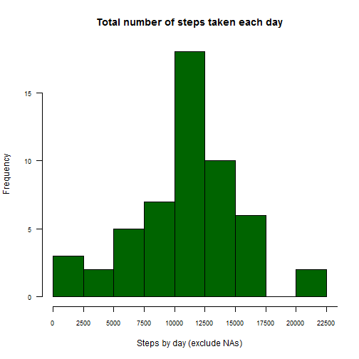
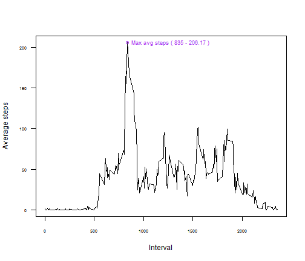
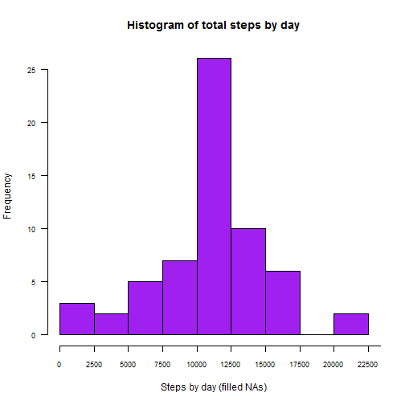
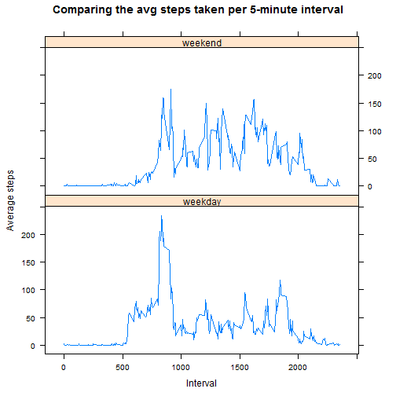

# Reproducible Research
## Peer assessment 1
========================================================

### Loading and preprocessing the data
#### 1. Load the data


```r
# prepareFiles 
# Download source file and uncompress it to make available for procesing
prepareFiles <- function(){
    # set several variables
    sourceFile <- "https://d396qusza40orc.cloudfront.net/repdata%2Fdata%2Factivity.zip?accessType=DOWNLOAD"
    targetFile <- "./dataProject01.zip"
     
    # download compressed file using mode wb to preserve as binary type
    download.file( sourceFile, 
                   destfile=targetFile, 
                   method="auto", 
                   mode="wb"
                 )       
    
    # uncompress file
    unzip( targetFile, 
           exdir = ".", 
           overwrite = TRUE 
         )
}


if (!file.exists("dataProject01.zip")) prepareFiles()
```

#### 2. Process/transform the data (if necessary) into a format suitable for your analysis


```r
# loadData
# load data into R using read and transforms column date as a Date type
loadData <- function(){
    dataSet <- read.csv("activity.csv")
    
    dataSet$date <- as.Date(dataSet$date)
    return( dataSet )
}

activityData <- loadData()
```


### What is mean total number of steps taken per day?

```r
# sumStepsByDay
# Sum steps for each day, stripping NA values
sumStepsByDay <- function(dataSet){
    return (aggregate(steps  ~ date, 
                      data = dataSet,
                      sum,
                      na.rm = TRUE
                 )
           )
}

my_Result1 <- sumStepsByDay(activityData)
```

#### 1. Make a histogram of the total number of steps taken each day

```r
hist(my_Result1$steps,
     col = "dark green",
     xlab = "Steps by day (exclude NAs)",
     main = "Total number of steps taken each day",
     las = 1,
     cex.axis = 0.75,
     breaks = c(0, 2500, 5000, 7500, 10000, 12500, 15000, 17500, 20000, 22500),
     xaxp = c(0, 25000, 10)
)
```

 
#### 2. Calculate and report the mean and median total number of steps taken per day

```r
mean(my_Result1$steps)
```

```
## [1] 10766
```

```r
median(my_Result1$steps)
```

```
## [1] 10765
```
### What is the average daily activity pattern?

```r
# averageStepsByInterval
# Calculates means for each interval, across all days, stripping NA values
averageStepsByInterval <- function(dataSet){
    return (aggregate(steps ~ interval,
                      data = dataSet,
                      mean,
                      na.rm = TRUE
                 )
           ) 
}

my_Result2 <- averageStepsByInterval(activityData)
```
#### 1. Make a time series plot (i.e. type = "l") of the 5-minute interval (x-axis) and the average number of steps taken, averaged across all days (y-axis)


```r
## get interval and total steps for max steps
my_MaxTuple <- subset(my_Result2, steps == max(my_Result2$steps))

plot(my_Result2$interval, 
     my_Result2$steps,
     type = "l",
     xlab = "Interval",
     ylab = "Average steps",
     las = 1,
     cex.axis = 0.6,
     )

# show max value for the steps
points(my_MaxTuple$interval,
       my_MaxTuple$steps, 
       col="purple"
      )

# show labels indicating interval and average steps for max value 
text(my_MaxTuple$interval,
     my_MaxTuple$steps, 
     pos = 4,
     col = "purple",
     labels = paste("Max avg steps (", 
                    my_MaxTuple$interval, 
                    "-", 
                    round(my_MaxTuple$steps, digits = 2), 
                    ")", 
                    sep = " "
                    ),
     cex = 0.75
    )
```

 
#### 2. Which 5-minute interval, on average across all the days in the activityData, contains the maximum number of steps?

```r
my_MaxTuple
```

```
##     interval steps
## 104      835 206.2
```
### Imputing missing values
#### 1. Calculate and report the total number of missing values in the activityData

```r
sum(is.na(activityData))
```

```
## [1] 2304
```

#### 2. Devise a strategy for filling in all of the missing values in the activityData
Strategy: to replace NAs by mean of the same interval


```r
# replaceNA
# Replaces NA for the specific value of mean corresponding to interval
replaceNA <- function(value, dataSet){
    averages <- averageStepsByInterval(dataSet)
 
    #identify NA for interval
    idx<-which(dataSet$interval == value & is.na(dataSet$steps))
    
    # Changes NA for mean of this interval
    dataSet[idx,1]<- averages[averages$interval==value,2]
    
    return(dataSet)
    
}
```

#### 3. Create a new activityData that is equal to the original activityData but with the missing data filled in

```r
# fillactivityData
# Changes NA values 
fillactivityData <- function(dataSet){
    activityDataFilled <- dataSet
    
    for (interval in unique(dataSet$interval))
        activityDataFilled <- replaceNA(interval, activityDataFilled )
    
    return(activityDataFilled)
}
```

*This take a long time, then it is cached*

```r
dataFilled <- fillactivityData(activityData)
```
#### 4. Make a histogram of the total number of steps taken each day 

```r
my_ResultFilled <- sumStepsByDay(dataFilled)

hist(my_ResultFilled$steps,
     col = "purple",
     xlab = "Steps by day (filled NAs)",
     main = "Histogram of total steps by day",
     las = 1,
     cex.axis = 0.75,
     breaks = c(0, 2500, 5000, 7500, 10000, 12500, 15000, 17500, 20000, 22500),
     xaxp = c(0, 25000, 10)
)
```

 
####     Calculate and report the mean and median total number of steps taken per day.


```r
mean(my_ResultFilled$steps)
```

```
## [1] 10766
```

```r
median(my_ResultFilled$steps)
```

```
## [1] 10766
```
##### *Do these values differ from the estimates from the first part of the assignment?*
Mean has the same value but Median differs

##### *What is the impact of imputing missing data on the estimates of the total daily number of steps?*
As mean for interval value replaced missing data  then Median value split to right, as expected

### Are there differences in activity patterns between weekdays and weekends? 

#### Create a new factor variable in the activityData with two levels - "weekday" and "weekend" indicating whether a given date is a weekday or weekend day.


```r
identifyWeekLevel <- function(dataSet){
    # uses day number to avoid differences by language (spanish vs english)
    dataSet$day_num <- as.POSIXlt(dataSet$date)$wday
    dataSet$day_level <- ifelse( dataSet$day_num == 0 | dataSet$day_num == 6, 
                              "weekend", 
                              "weekday")
    
    # eliminates column for day_num
    dataSet <- dataSet[,-4]
    return(dataSet)
}
```

#### Make a panel plot containing a time series plot 

```r
# averageStepsByDayLevel
# Calculates means for each interval, by day level, stripping NA values
averageStepsByDayLevel <- function(dataSet){
    return (aggregate(steps ~ .,
                      data = dataSet,
                      mean,
                      na.rm = TRUE
                 )
           ) 
}

tmp <- identifyWeekLevel(activityData)

# calculates mean avoiding date field
my_Result4 <- averageStepsByDayLevel(tmp[,-2])


library(lattice)

xyplot(steps ~ interval | day_level, 
       data = my_Result4, 
       type = "l", 
       layout = c(1, 2),
       ylab = "Average steps",
       xlab = "Interval",
       main = "Comparing the avg steps taken per 5-minute interval"
       )
```

 

